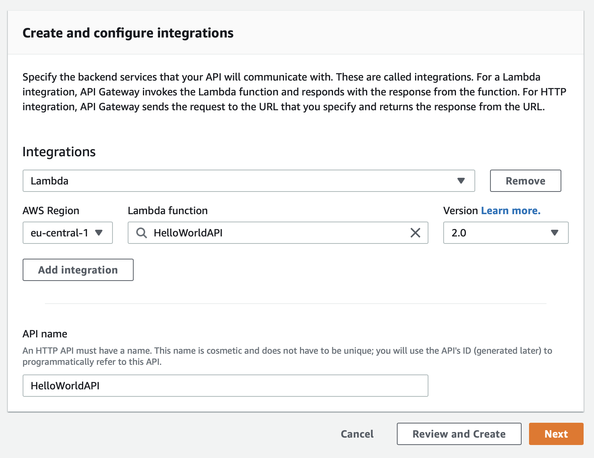

# Create your first HTTP endpoint with Swift on AWS Lambda

This tutorial shall help you to create and deploy your first Swift Lambda HTTP endpoint. It assumes that you have completed the [Getting started with Swift AWS Lambda Runtime](01-getting-started.md) tutorial, since it starts where the former ended. We will modify the existing code to work as an HTTP endpoint.

AWS Services integrate with Lambda by sending special json payloads to Lambda. [`swift-aws-lambda-runtime`](https://github.com/swift-server/swift-aws-lambda-runtime) already offers implementations for a number of these services out of the box with the [`AWSLambdaEvents`](https://github.com/swift-server/swift-aws-lambda-runtime/tree/master/Sources/AWSLambdaEvents) library. To integrate your Lambda with an AWS Service your Lambda's input and output types must match the requirements of the invoking service. 

In this example we will use the [Amazon API Gateway's HTTP API Service](https://docs.aws.amazon.com/apigateway/latest/developerguide/http-api.html) to build an HTTP endpoint with Lambda. Sometimes the HTTP API Service within Amazons API Gateway is also referred to as APIGateway v2. Still confused? I guess the Amazon APIGateway naming is the hardest part in this tutorial.

You can find the resulting code on [GitHub](https://github.com/fabianfett/swift-aws-lambda-api-hello-world).

If you have any questions or recommendations, open an [issue on GitHub](https://github.com/swift-server/swift-aws-lambda-runtime/issues) so that you can get your question answered and this tutorial can be improved.

*Note: The following instructions were recorded on July 27, 2020 and the GUI may have changed since then. Feel free to open a GitHub issue if you see a different one.*

### Step 1: Modify the Package.swift

To integrate with AWS' APIGateway we need to include another dependency from the `swift-aws-lambda-runtime` package: `AWSLambdaEvents`. It offers a bunch of AWS event `struct`s  that make it easier to integrate your Lambda into the AWS ecosystem. 

Add `AWSLambdaEvents` to your target's dependencies:

```swift
  .product(name: "AWSLambdaEvents", package: "swift-aws-lambda-runtime"),
```

And rename your target and product from `SquareNumber` to `HelloWorld`.

In the end your `Package.swift` should look like this:

```swift
// swift-tools-version:5.2
// The swift-tools-version declares the minimum version of Swift required to build this package.
   
import PackageDescription
   
let package = Package(
  name: "HelloWorld",
  products: [
    .executable(name: "HelloWorld", targets: ["HelloWorld"]),
  ],
  dependencies: [
    .package(url: "https://github.com/swift-server/swift-aws-lambda-runtime.git", .upToNextMajor(from:"0.3.0")),
  ],
  targets: [
    .target(
      name: "HelloWorld",
      dependencies: [
        .product(name: "AWSLambdaRuntime", package: "swift-aws-lambda-runtime"),
        .product(name: "AWSLambdaEvents", package: "swift-aws-lambda-runtime"),
      ]
    ),
  ]
)
```

Next you must rename your "SquareNumbers" folder in `Sources` to "HelloWorld" to match the new `Package.swift`s naming.

### Step 2: Use the correct Event Types

In the `main.swift` import our new dependency first by adding: 

```swift
import AWSLambdaEvents
```

As mentioned before: To integrate with an AWS Service, the Lambda's input and output types must match the events the service sends. For this reason, to integrate with APIGateway v2 our input is of type `APIGateway.V2.Request` and our output is of type `APIGateway.V2.Response`. Let's change our `Lambda.run` method to the following:

```swift
Lambda.run { (context, request: APIGateway.V2.Request, callback: @escaping (Result<APIGateway.V2.Response, Error>) -> Void) in
  preconditionFailure("Not implemented yet")
}
```

### Step 3: Implement the Lambda

The Lambda already compiles, but it crashes immediately. So let's build some logic!

First let's always respond with "Hello World". For this we call our callback with an `APIGateway.V2.Response` in which we set the `statuscode` to `.ok` and the `body` to `"Hello World"`.

```swift
Lambda.run { (context, request: APIGateway.V2.Request, callback: @escaping (Result<APIGateway.V2.Response, Error>) -> Void) in
  callback(.success(APIGateway.V2.Response(statusCode: .ok, body: "Hello World")))
}
```

By setting the environment variable `LOCAL_LAMBDA_SERVER_ENABLED` to `true` in the [targets build settings](/getting-started-with-swift-aws-lambda-runtime#step-4-test-your-lambda-locally) you enable local debugging support.

> ⚠️ **Warning:** Since we have renamed our Swift Package Manager target in Step 1, Xcode has created a new target "HelloWorld" for us. For this reason the environment variable [`LOCAL_LAMBDA_SERVER_ENABLED`](/getting-started-with-swift-aws-lambda-runtime#step-4-test-your-lambda-locally) must be set to [`true`](/getting-started-with-swift-aws-lambda-runtime#step-4-test-your-lambda-locally) again in the new "HelloWorld" target!

It might be assumed that we are now able to invoke the Lambda simply by calling:

```bash
$ curl -i http://localhost:7000/invoke
```

The response looks like this:

```bash
HTTP/1.1 404 Not Found
content-length: 0
```

`404` is status not found. But we did return `.ok` in the code... Why is this happening?

Even though our Lambda will serve HTTP requests, its input and output are still json and not an HTTP request. This is why we have made two mistakes:

1. We tried to call the `/invoke` endpoint with a `GET` method, but it always has to be a `POST`.
2. We did not supply a json payload for the Lambda to deal with.

Since we will use Amazon API Gateway, incoming HTTP request will be transformed into json by the API Gateway. The created json request is then handed over to Lambda. The Lambda will process the request and respond with json, which the API Gateway will then translate back into an outgoing HTTP response. 

Incoming HTTP requests will look like this after they have been transformed to json:

```json
{
    "routeKey":"GET /hello",
    "version":"2.0",
    "rawPath":"/hello",
    "stageVariables":{},
    "requestContext":{
        "timeEpoch":1587750461466,
        "domainPrefix":"hello",
        "accountId":"0123456789",
        "stage":"$default",
        "domainName":"hello.test.com",
        "apiId":"pb5dg6g3rg",
        "requestId":"LgLpnibOFiAEPCA=",
        "http":{
            "path":"/hello",
            "userAgent":"Paw/3.1.10 (Macintosh; OS X/10.15.4) GCDHTTPRequest",
            "method":"GET",
            "protocol":"HTTP/1.1",
            "sourceIp":"91.64.117.86"
        },
        "time":"24/Apr/2020:17:47:41 +0000"
    },
    "isBase64Encoded":false,
    "rawQueryString":"",
    "headers":{
        "host":"hello.test.com",
        "user-agent":"Paw/3.1.10 (Macintosh; OS X/10.15.4) GCDHTTPRequest",
        "content-length":"0"
    }
}
```

So let's invoke our Lambda with the example payload from above, using the `POST` method:

```bash
$ curl --header "Content-Type: application/json" \
  --request POST \
  --data '{
        "routeKey":"GET /hello",
        "version":"2.0",
        "rawPath":"/hello",
        "stageVariables":{},
        "requestContext":{
            "timeEpoch":1587750461466,
            "domainPrefix":"hello",
            "accountId":"0123456789",
            "stage":"$default",
            "domainName":"hello.test.com",
            "apiId":"pb5dg6g3rg",
            "requestId":"LgLpnibOFiAEPCA=",
            "http":{
                "path":"/hello",
                "userAgent":"Paw/3.1.10 (Macintosh; OS X/10.15.4) GCDHTTPRequest",
                "method":"GET",
                "protocol":"HTTP/1.1",
                "sourceIp":"91.64.117.86"
            },
            "time":"24/Apr/2020:17:47:41 +0000"
        },
        "isBase64Encoded":false,
        "rawQueryString":"",
        "headers":{
            "host":"hello.test.com",
            "user-agent":"Paw/3.1.10 (Macintosh; OS X/10.15.4) GCDHTTPRequest",
            "content-length":"0"
        }
    }' \
  http://localhost:7000/invoke
```

The response should look like this:

```json
{"statusCode":200,"body":"Hello World"}
```

### Step 4: JSON

Next, let's change our Lambda to handle a json input on the `/hello` route with method `POST`. The input should look like this: `{"name":"fabian"}` and the output like this `{"hello":"fabian"}`.

1. To represent our json input and output let's first change our `Input` and `Output` structs to:

    ```swift
    struct Input: Codable {
      let name: String
    }
    
    struct Output: Codable {
      let hello: String
    }
    ```

2. As you may have realized by now, the `APIGateway.V2.Response` and `APIGateway.V2.Response` have both a property `body` that is of type optional `String`. That means, we get a payload as a `String` and not as `Data` (which is what you normally have, if you deal with responses from `NSURLSession` for example). That's why, if you get an HTTP request that has json as its payload, we need to decode the payload from a `String` instead of `Data`. If we want to reply with a json response, we further have to encode the payload as a `String`. To ease the process we can use the extensions below, which can be copied below the `Lambda.run` command:

    ```swift
    extension JSONEncoder {
      func encodeAsString<T: Encodable>(_ value: T) throws -> String {
        try String(decoding: self.encode(value), as: Unicode.UTF8.self)
      }
    }
    
    extension JSONDecoder {
      func decode<T: Decodable>(_ type: T.Type, from string: String) throws -> T {
        try self.decode(type, from: Data(string.utf8))
      }
    }
    ```

    > ⚠️ **Warning**: You have to `import Foundation`, to get this code to compile.

3. Since we want to reuse our `JSONEncoder` and `JSONDecoder` for every request (this will yield better performance), an encoder and decoder should be created before our `Lambda.run` method. That way, they can be captured within our Lambda callback.

    ```swift
    let jsonEncoder = JSONEncoder()
    let jsonDecoder = JSONDecoder()
    
    Lambda.run { (context, request: APIGateway.V2.Request, callback: @escaping (Result<APIGateway.V2.Response, Error>) -> Void) in
      callback(.success(APIGateway.V2.Response(statusCode: .ok, body: "Hello World")))
    }
    ```

4. Now it's finally time to implement the Lambda itself:
    
    First, let's check if we have received a `POST` request to the `/hello` path. Otherwise a statuscode `404` (Not found) should be returned.

    ```swift 
    guard request.context.http.method == .POST, request.context.http.path == "/hello" else {
      return callback(.success(APIGateway.V2.Response(statusCode: .notFound)))
    }
    ```

    Next, the request's payload needs to be decoded. If the request doesn't have a body, we will just use an empty string instead. In this case or any other malformed json payload case, the decoder will throw an error, which will be signaled to the user by statuscode `400` (bad request).

    ```swift
    do {
      let input = try jsonDecoder.decode(Input.self, from: request.body ?? "")
    }
    catch {
      callback(.success(APIGateway.V2.Response(statusCode: .badRequest)))
    }
    ```

    If successful, we will create an `Output` struct and encode it back into json. To make clients aware that they will receive a json payload, a `content-type` header can be added:

    ```swift
    let responseBody = Output(hello: input.name)
    let body = try jsonEncoder.encodeAsString(responseBody)
    callback(.success(APIGateway.V2.Response(
      statusCode: .ok, 
      multiValueHeaders: ["content-type": ["application/json"]], 
      body: body)))
    ```

5. Putting it all together your code should look like this:

    ```swift
    import AWSLambdaRuntime
    import AWSLambdaEvents
    import Foundation
    
    struct Input: Codable {
      let name: String
    }
    
    struct Output: Codable {
      let hello: String
    }
    
    let jsonEncoder = JSONEncoder()
    let jsonDecoder = JSONDecoder()
    
    Lambda.run { (context, request: APIGateway.V2.Request, callback: @escaping (Result<APIGateway.V2.Response, Error>) -> Void) in
      guard request.context.http.method == .POST, request.context.http.path == "/hello" else {
        return callback(.success(APIGateway.V2.Response(statusCode: .notFound)))
      }
      
      do {
        let input = try jsonDecoder.decode(Input.self, from: request.body ?? "")
        let body = try! jsonEncoder.encodeAsString(Output(hello: input.name))
        callback(.success(APIGateway.V2.Response(
          statusCode: .ok, 
          multiValueHeaders: ["content-type": ["application/json"]], 
          body: body)))
      }
      catch {
        callback(.success(APIGateway.V2.Response(statusCode: .badRequest)))
      }
    }
    
    extension JSONEncoder {
      func encodeAsString<T: Encodable>(_ value: T) throws -> String {
        try String(decoding: self.encode(value), as: Unicode.UTF8.self)
      }
    }
    
    extension JSONDecoder {
      func decode<T: Decodable>(_ type: T.Type, from string: String) throws -> T {
        try self.decode(type, from: Data(string.utf8))
      }
    }
    ```

6. Let's test this locally.

    Build and run your target locally and invoke on your command line:

    ```bash
    $ curl --header "Content-Type: application/json" \
      --request POST \
      --data '{
            "routeKey":"POST /hello",
            "version":"2.0",
            "rawPath":"/hello",
            "stageVariables":{},
            "requestContext":{
                "timeEpoch":1587750461466,
                "domainPrefix":"hello",
                "accountId":"0123456789",
                "stage":"$default",
                "domainName":"hello.test.com",
                "apiId":"pb5dg6g3rg",
                "requestId":"LgLpnibOFiAEPCA=",
                "http":{
                    "path":"/hello",
                    "userAgent":"Paw/3.1.10 (Macintosh; OS X/10.15.4) GCDHTTPRequest",
                    "method":"POST",
                    "protocol":"HTTP/1.1",
                    "sourceIp":"91.64.117.86"
                },
                "time":"24/Apr/2020:17:47:41 +0000"
            },
            "body": "{\"name\":\"Fabian\"}",
            "isBase64Encoded":false,
            "rawQueryString":"",
            "headers":{
                "host":"hello.test.com",
                "user-agent":"Paw/3.1.10 (Macintosh; OS X/10.15.4) GCDHTTPRequest",
                "content-length":"0"
            }
        }' \
      http://localhost:7000/invoke
    ```

    > ⚠️ **Note**: We have changed the `GET` to `POST` in this payload and added a `body`, that holds a string containing json.

    Your result should look something like this:

    ```json
    {"statusCode":200,"body":"{\"hello\":\"Fabian\"}"}
    ```

### Step 5: Simple static routing

Next let's support a call to `GET` on `/hello` as well. In this case we want to respond with `{"hello": "world"}`. The easiest way to implement some static routing is with [a `switch` statement](https://docs.swift.org/swift-book/LanguageGuide/ControlFlow.html#ID129):

```swift
switch (request.context.http.path, request.context.http.method) {
  case ("/hello", .GET):
    // handling
  case ("/hello", .POST):
    // handling
  default:
    return callback(.success(APIGateway.V2.Response(statusCode: .notFound)))
}
```

With the number of code paths rising, the chances to forget to call `callback` are increasing as well. That's why, I'd encourage you to use a code style as below, in which the compiler enforces a response in every code path, before sending your response:

```swift
let response: APIGateway.V2.Response

switch (request.context.http.path, request.context.http.method) {
case ("/hello", .GET):
  let body = try! jsonEncoder.encodeAsString(Output(hello: "world"))
  response = APIGateway.V2.Response(
    statusCode: .ok,
    multiValueHeaders: ["content-type": ["application/json"]],
    body: body)
case ("/hello", .POST):
  do {
    let input = try jsonDecoder.decode(Input.self, from: request.body ?? "")
    let body = try! jsonEncoder.encodeAsString(Output(hello: input.name))
    response = APIGateway.V2.Response(
      statusCode: .ok,
      multiValueHeaders: ["content-type": ["application/json"]],
      body: body)
  }
  catch {
    response = APIGateway.V2.Response(statusCode: .badRequest)
  }
default:
  response = APIGateway.V2.Response(statusCode: .notFound)
}

callback(.success(response))
```

Replace your `Lambda.run` with the code above.

### Step 6: Build your Lambda

As mentioned earlier, this tutorial assumes that you already have a script `package.sh` in the `scripts` folder of your repo.

If you don't, now it's the time to revisit the [Build and Package section](/getting-started-with-swift-aws-lambda-runtime#step-5-build-your-code-for-the-aws-lambda-environment) of our [Getting started with Swift on AWS Lambda tutorial](01-getting-started.md).

This being settled, let's build the Lambda:

```bash
$ docker run \
    --rm \
    --volume "$(pwd)/:/src" \
    --workdir "/src/" \
    swift:5.3.1-amazonlinux2 \
    swift build --product HelloWorld -c release -Xswiftc -static-stdlib 
```

Next let's package the Lambda:

```bash
$ scripts/package.sh HelloWorld
```

> **Note:** Remember the `.build` folder is hidden on macOS by default. In Finder use the keyboard shortcut `Cmd + Shift + .` to show hidden files. You can now navigate to `.build/lambda/HelloWorld/lambda.zip`. If everything went well, your lambda.zip should be around 22MB.

### Step 7: Update your Lambda on AWS

Now it's the time to create a new AWS Lambda function. Open the AWS Console and navigate to [Lambda](https://console.aws.amazon.com/lambda/home). Select "Functions" in the side navigation and click on "Create function" in the upper right corner. Make sure "Author from Scratch" is selected and give your function a name. I've choosen "HelloWorldAPI". Select the runtime "Provide your own bootstrap on Amazon Linux 2". Leave the rest of the settings as is, and hit the "Create function" button to proceed.


Once the function has been created, your `lambda.zip` needs to be uploaded.

You should see the section "Function Code" in the lower part of the screen. Click the dropdown "Actions" on the right side and select "Upload a zip file". Click on "Upload" and select your `lambda.zip`. Next click "Save".


### Step 8: Connect with an API Gateway

At last an AWS APIGateway must be created and connected to your Lambda. 

Navigate to [API Gateway](https://console.aws.amazon.com/apigateway/home) in the AWS Console. Select "APIs" in the side navigation and click on "Create API" in the upper right corner. Choose "HTTP API" as your API type and click its "Build" button. A "Create an API" Wizard will be opened.

Click the "Add Integration" button and select "Lambda" from the dropdown. Next you'll need to select the Lambda, you've just created. Since ours is called "HelloWorldAPI", We can find it quite easily. Make sure `2.0` is selected as your Version. (The version number here must match your code's event types version number: `APIGateway.V2.Request`). Eventually enter a name for the API (we call ours "HelloWorldAPI") and click "Next".



In the step "Configure routes" you must connect the routes your API shall serve with your integration target (your Lambda). The magic keyword to catch all routes is `$default`. This will proxy all routes to your Lambda.


In the step "Configure stages" step everything can remain as is. Click "Next" to continue.


Finally all settings can be reviewed. Click on "Create" to proceed, which should forward you to your new API Gateway:


The API Gateway's url can be seen in the column "Invoke URL" for the stage `$default`:

Test `POST` request to `/hello` (replace `{gatewayid}` and `{region}` with your values):

```bash
$ curl -i --request POST \ 
  --header "Content-Type: application/json" \
  --data '{"name": "fabian"}' \
  https://{gatewayid}.execute-api.{region}.amazonaws.com/hello
```

Test `GET` request to `/hello`:

```bash
$ curl -i https://{gatewayid}.execute-api.{region}.amazonaws.com/hello
```

Test `GET` request to `/hello2`:

```bash
$ curl -i https://{gatewayid}.execute-api.{region}.amazonaws.com/hello2
```

You should see that the APIGateway answers with a `404`.

### Closing notes

Hopefully you are now able to create a simple API yourself using [`swift-aws-lambda-runtime`](https://github.com/swift-server/swift-aws-lambda-runtime). As you may have noticed the manual process of creating and updating your Lambda functions is quite cumbersome. There are tools out there, that will make your job considerably easier:

- [AWS Serverless Application Model (AWS SAM)](https://docs.aws.amazon.com/serverless-application-model/latest/developerguide/what-is-sam.html)
- [Serverless framework](https://www.serverless.com/open-source/)

Further we want to shout out to some other great Swift on Lambda tutorials that can take you further:

- [Sending SNS messages to Slack using EventLoopFutures](https://www.opticalaberration.com/2020/06/investigating-swift-aws-lambda-runtime.html) by [@o_aberration](https://twitter.com/o_aberration)
- [SES Email forwarding using the community driven AWS-SDK-Swift](https://www.opticalaberration.com/2020/06/investigating-swift-aws-lambda-runtime-part2.html) by [@o_aberration](https://twitter.com/o_aberration)

Feedback is highly welcome.
